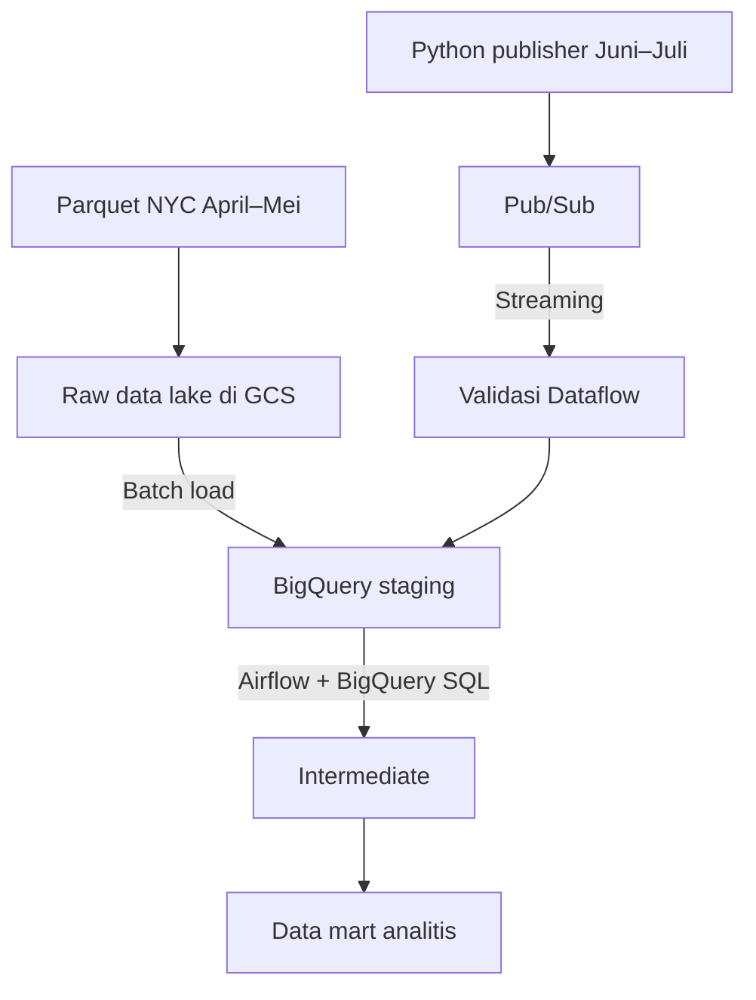

# Taufiqzahrus — Pipeline Batch dan Streaming NYC Green Taxi di GCP

Capstone Project 3 ini mengimplementasikan pipeline data hibrida di Google Cloud Platform (GCP):

```text
Batch      : NYC Green Taxi April–Mei (Parquet) → GCS → BigQuery staging
Streaming  : Python publisher → Pub/Sub → Dataflow → BigQuery staging
Transformasi: BigQuery staging → intermediate → data mart (diorkestrasi Airflow)
```

## Identitas dan resource cloud

| Konfigurasi       | Nilai                              | Fungsi                                             |
| ----------------- | ---------------------------------- | -------------------------------------------------- |
| ID peserta        | `taufiqzahrus`                     | Kepemilikan DAG dan jalur submission               |
| Project GCP       | `jcdeah-009`                       | Project induk seluruh layanan cloud                |
| Bucket GCS        | `taufiqzahrus-capstone3`           | Penyimpanan data batch dan file sementara Dataflow |
| Dataset BigQuery  | `taufiqzahrus_capstone3`           | Tabel staging, intermediate, dan mart              |
| Topic Pub/Sub     | `taufiqzahrus-green-taxi-events`   | Tujuan event yang dibuat publisher                 |
| Pull subscription | `taufiqzahrus-green-taxi-dataflow` | Sumber event untuk Dataflow                        |

Nama resource tersebut bukan credential. Credential tidak disimpan di repository dan diperoleh melalui Application Default Credentials (ADC) atau service account yang terpasang pada VM.

Alur batch menggunakan pola ELT. Alur streaming menggunakan pola ETL karena Dataflow memvalidasi dan mentransformasi setiap event sebelum menulisnya ke BigQuery. Dataflow menjadi satu-satunya subscriber yang menulis event streaming; jangan membuat BigQuery subscription langsung pada topic yang sama.

## Arsitektur



Sumber diagram yang tersedia di `Documentation/Diagram_pipeline.png`.

## Struktur repository

```text
dags/          DAG Airflow mandiri untuk repository mentor
dataflow/      Pipeline streaming Apache Beam/Dataflow
publisher/     Generator dan publisher dummy event Juni–Juli
schemas/       Kontrak/schema event streaming
scripts/       Setup GCP, upload batch, dan deployment Dataflow
sql/           Transformasi warehouse dan query analitis
tests/         Unit test yang dapat dijalankan secara offline
Documentation/ Bukti screenshot eksekusi dan validasi
docs/          Referensi kode, fungsi, variabel, schema, dan task
diagrams/      Sumber diagram arsitektur
```

## Prasyarat

- Python 3.10–3.14. Untuk Python 3.14 diperlukan Apache Beam 2.73.0 atau lebih baru; proyek ini menggunakan Apache Beam 2.75.0.
- Google Cloud CLI (`gcloud`) yang telah diautentikasi.
- Project GCP dengan billing aktif dan izin IAM yang diperlukan.
- Docker dan Docker Compose untuk menjalankan Airflow.
- ID peserta resmi `taufiqzahrus`.

Jangan pernah commit `.env`, file JSON service account, password, token, atau credential lain ke GitHub.

## Panduan mentor: menjalankan dua repository secara end-to-end

Submission ini menggunakan dua repository terpisah:

| Repository                 | Revisi yang digunakan              | Fungsi                                                                     |
| -------------------------- | ---------------------------------- | -------------------------------------------------------------------------- |
| `airflow-capstone-project` | Branch `taufiq-capstone3`          | Runtime Airflow 3 berbasis Docker dan DAG submission                       |
| `Capstone_3_Taufiq`        | Branch submission, biasanya `main` | Setup GCP, batch uploader, publisher, Dataflow, SQL, test, dan dokumentasi |

Clone kedua repository ke dalam satu folder induk. `Dockerfile` dan `docker-compose.yml` tetap berada di repository Airflow dan tidak perlu disalin ke repository Capstone.

```bash
mkdir -p capstone-review
cd capstone-review

git clone --branch taufiq-capstone3 --single-branch \
  https://github.com/Taufiqzs/airflow-capstone-project.git

git clone https://github.com/Taufiqzs/Capstone_3 Capstone_3_Taufiq
```

Struktur folder yang diharapkan:

```text
capstone-review/
├── airflow-capstone-project/
└── Capstone_3_Taufiq/
```

Branch Airflow tersebut sudah memiliki DAG berikut, sehingga mentor tidak perlu menyalinnya secara manual:

```text
airflow-capstone-project/dags/submissions/taufiqzahrus/
└── taufiqzahrus_green_taxi_pipeline.py
```

### A. Menyiapkan dan menjalankan Airflow

```bash
cd capstone-review/airflow-capstone-project
git branch --show-current
```

Hasilnya harus menunjukkan `taufiq-capstone3`. Buat konfigurasi lokal dari contoh yang tersedia:

```bash
cp .env.example .env
```

Isi nilai rahasia hanya pada `.env` lokal. Jangan commit atau membagikan file tersebut. Validasi dan jalankan Airflow:

```bash
docker compose config
docker compose build
docker compose up -d
docker compose ps
```

Pastikan DAG terdeteksi:

```bash
docker compose exec airflow-scheduler \
  airflow dags list | grep taufiqzahrus_green_taxi_pipeline
```

Jika container belum sehat, periksa status dan log:

```bash
docker compose ps
docker compose logs --tail=100 airflow-scheduler airflow-api-server
```

### B. Menyiapkan proyek Capstone

Buka terminal kedua:

```bash
cd capstone-review/Capstone_3_Taufiq
python3 -m venv .venv
source .venv/bin/activate
python3 -m pip install --upgrade pip
python3 -m pip install -r requirements.txt
cp .env.example .env
```

Autentikasi menggunakan akun Google Cloud milik reviewer. Jangan meminta atau menggunakan file key service account milik peserta:

```bash
gcloud auth login
gcloud auth application-default login
gcloud config set project jcdeah-009
```

Muat konfigurasi ke sesi Bash:

```bash
set -a
source .env
set +a
```

Periksa nama resource di `.env` sebelum membuat resource cloud. Reviewer harus memiliki izin IAM dan akses billing yang memadai pada project tujuan.

### C. Validasi lokal sebelum eksekusi cloud

```bash
python3 -m pytest -q
python3 -m compileall -q dags dataflow publisher scripts tests
bash -n scripts/setup_gcp.sh
bash -n scripts/run_dataflow.sh
python3 -m json.tool schemas/green_taxi_event.schema.json >/dev/null
python3 publisher/publish_green_taxi.py --dry-run --count 1 --rate 100
```

### D. Menjalankan pipeline cloud

Dari repository `Capstone_3_Taufiq`, buat resource GCP dan unggah data batch April–Mei:

```bash
bash scripts/setup_gcp.sh
python3 scripts/upload_batch_to_gcs.py
```

Jalankan Dataflow:

```bash
bash scripts/run_dataflow.sh
```

Setelah job streaming berstatus berjalan, buka terminal lain dengan virtual environment dan `.env` yang sama, lalu kirim sampel event:

```bash
python3 publisher/publish_green_taxi.py --count 100 --rate 5
```

Trigger DAG dari repository Airflow:

```bash
cd ../airflow-capstone-project
docker compose exec airflow-scheduler \
  airflow dags trigger taufiqzahrus_green_taxi_pipeline
```

Periksa lima run terbaru:

```bash
docker compose exec airflow-scheduler \
  airflow dags list-runs -d taufiqzahrus_green_taxi_pipeline --limit 5
```

Run juga dapat diperiksa melalui Airflow UI. Run yang berhasil akan membuat atau memperbarui tabel staging, intermediate, dan mart.

### E. Memverifikasi output BigQuery

```bash
bq query --use_legacy_sql=false '
SELECT table_id, row_count, size_bytes
FROM `jcdeah-009.taufiqzahrus_capstone3.__TABLES__`
ORDER BY table_id'
```

```bash
bq query --use_legacy_sql=false '
SELECT source_type,
       COUNT(*) AS total_baris,
       COUNT(DISTINCT trip_id) AS perjalanan_unik
FROM `jcdeah-009.taufiqzahrus_capstone3.int_green_taxi_trips`
GROUP BY source_type
ORDER BY source_type'
```

Query validasi yang lebih lengkap tersedia di `docs/VALIDATION_REPORT.md` dan `sql/analytics/`. Bukti visual hasil eksekusi tersedia di folder `Documentation/`.

### F. Menghentikan resource setelah review

Job streaming Dataflow tetap menimbulkan biaya sampai dihentikan. Batalkan job melalui Google Cloud Console atau gunakan `gcloud dataflow jobs cancel` dengan job ID yang muncul saat deployment.

Hentikan Airflow lokal tanpa menghapus volume:

```bash
cd capstone-review/airflow-capstone-project
docker compose stop
```

Gunakan `docker compose down` hanya jika container dan network sudah tidak diperlukan. Jangan menambahkan `--volumes` kecuali metadata lokal Airflow memang ingin dihapus.

## Menjalankan komponen secara terpisah

### 1. Setup lokal

```bash
python3 -m venv .venv
source .venv/bin/activate        # Windows PowerShell: .venv\Scripts\Activate.ps1
python3 -m pip install -r requirements.txt
cp .env.example .env
```

### 2. Membuat resource GCP

```bash
bash scripts/setup_gcp.sh
```

Script membuat bucket, dataset BigQuery, topic Pub/Sub, dan pull subscription Dataflow dengan prefix identitas peserta. Dataflow akan membuat tabel valid dan dead-letter yang dikonfigurasi. Script tidak membuat BigQuery subscription karena penulisan streaming dimiliki Dataflow.

### 3. Mengunggah batch April–Mei

```bash
python3 scripts/upload_batch_to_gcs.py
```

Script mengunduh file Parquet resmi NYC Green Taxi April dan Mei 2025, lalu mengunggahnya ke `gs://$GCS_BUCKET/raw/`. File data mentah tidak disimpan di GitHub.

### 4. Menjalankan pipeline streaming

```bash
bash scripts/run_dataflow.sh
```

Dataflow membaca pull subscription, mem-parsing JSON, menjalankan aturan validasi, menambahkan field turunan, menulis event valid ke `$BIGQUERY_DATASET.stg_green_taxi_stream`, dan menulis event tidak valid ke `stg_green_taxi_stream_dead_letter`.

### 5. Menjalankan publisher

```bash
python3 publisher/publish_green_taxi.py --rate 5 --count 100
```

- `--rate` mengatur jumlah event per detik.
- `--count 0` menjalankan publisher sampai dihentikan dengan `Ctrl+C`.
- SIGINT/SIGTERM menghentikan publisher dengan aman setelah pending future selesai.
- Waktu perjalanan berada pada rentang `[2025-06-01, 2025-08-01)` UTC.
- `ingestion_time` merekam waktu aktual event dibuat.

Dry run tanpa GCP:

```bash
python3 publisher/publish_green_taxi.py --count 3 --rate 10 --dry-run
```

### 6. Menjalankan DAG Airflow

DAG berada pada branch `taufiq-capstone3` di:

```text
dags/submissions/taufiqzahrus/taufiqzahrus_green_taxi_pipeline.py
```

Konstanta utama di dalam DAG:

```python
STUDENT_ID = "taufiqzahrus"
PROJECT_ID = "jcdeah-009"
```

DAG melakukan proses berikut:

1. Memastikan dua objek Parquet tersedia di GCS.
2. Memuat data April–Mei ke `stg_green_taxi_batch` menggunakan `WRITE_TRUNCATE`.
3. Memeriksa jumlah baris dan field wajib batch.
4. Membuat ulang tabel intermediate terpadu yang sudah dideduplikasi.
5. Memeriksa nilai tidak valid, duplikasi, dan freshness data streaming.
6. Membuat ulang mart harian dan bulanan.

Proses load dan transformasi menggunakan replace semantics agar eksekusi ulang tidak menambahkan duplikasi.

## Kualitas dan keandalan data

Pipeline memeriksa:

- Kesesuaian schema dan validitas JSON di Dataflow.
- Durasi, jarak, fare, dan total amount yang positif.
- Timestamp pickup dan drop-off pada periode Juni–Juli untuk streaming.
- Waktu pickup harus lebih awal daripada drop-off.
- Payment type dan passenger count yang didukung.
- Jumlah baris batch serta field timestamp/lokasi wajib.
- Duplikasi berdasarkan `trip_id` yang stabil.
- Freshness streaming berdasarkan `ingestion_time`.

Pub/Sub dan Dataflow dapat menggunakan pengiriman at-least-once. Setiap event streaming memiliki UUID `event_id`, sedangkan tabel intermediate mempertahankan satu baris untuk setiap `trip_id`.

## Partisi dan clustering

- Tabel intermediate dipartisi berdasarkan `pickup_date` dan di-cluster berdasarkan `source_type`, `pickup_location_id`, serta `payment_type`.
- Mart harian dipartisi berdasarkan `pickup_date` dan di-cluster berdasarkan `source_type`.
- Mart bulanan merupakan tabel agregat kecil sehingga tidak memerlukan partisi.

Konfigurasi ini mengurangi pemindaian data untuk filter tanggal dan mendukung perbandingan batch-stream tanpa membuat partisi berlebihan pada agregat kecil.

## Analisis

Contoh query tersedia di `sql/analytics/`:

- `01_batch_monthly_summary.sql`: ringkasan performa batch April–Mei.
- `02_batch_vs_stream.sql`: perbandingan metrik batch dan streaming.

Kedua file telah menggunakan project `jcdeah-009` dan dataset `taufiqzahrus_capstone3`.

## Standar dokumentasi kode

- Modul, class, dan function Python memiliki dokumentasi tujuan.
- Function menjelaskan parameter, hasil, dan exception yang relevan.
- Konstanta dan variabel diberi komentar sesuai perannya.
- Function shell, nilai default, serta perintah cloud didokumentasikan.
- SQL menjelaskan tujuan tabel, filter, field, nilai turunan, dan batas periode bisnis.
- JSON Schema memberikan deskripsi yang mudah dibaca untuk setiap properti event.
- `docs/CODE_REFERENCE.md` menyediakan referensi kode terpusat.

## Pengendalian biaya

- Hentikan job streaming Dataflow segera setelah bukti selesai dikumpulkan.
- Gunakan nilai `--rate` dan `--count` kecil selama pengujian.
- Gunakan filter tanggal ketika membaca tabel BigQuery yang dipartisi.
- Lifecycle GCS menghapus raw demo file setelah 30 hari sesuai konfigurasi setup.
- Gunakan free tier, sandbox, atau credit GCP jika tersedia.

## Bukti dokumentasi

Folder `Documentation/` berisi bukti GCS, Pub/Sub, Dataflow, Airflow, BigQuery, dead-letter handling, pemeriksaan kualitas data, dan hasil query analitis. Jangan memasukkan credential atau nilai rahasia ke dalam screenshot.

## Keamanan repository sebelum commit

Pastikan file berikut tidak ikut di-stage atau diunggah:

```text
.env
__pycache__/
*.pyc
*.egg-info/
```

Periksa terlebih dahulu dengan:

```bash
git status --short
git diff --check
git diff --cached
```
